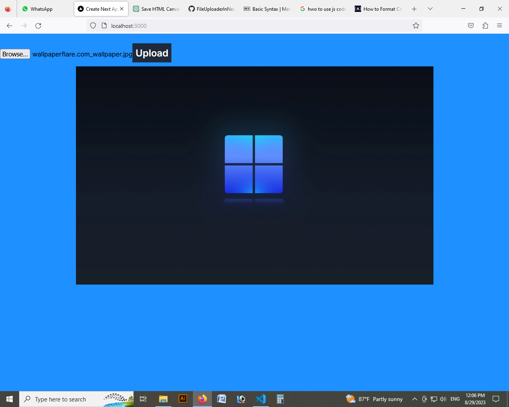
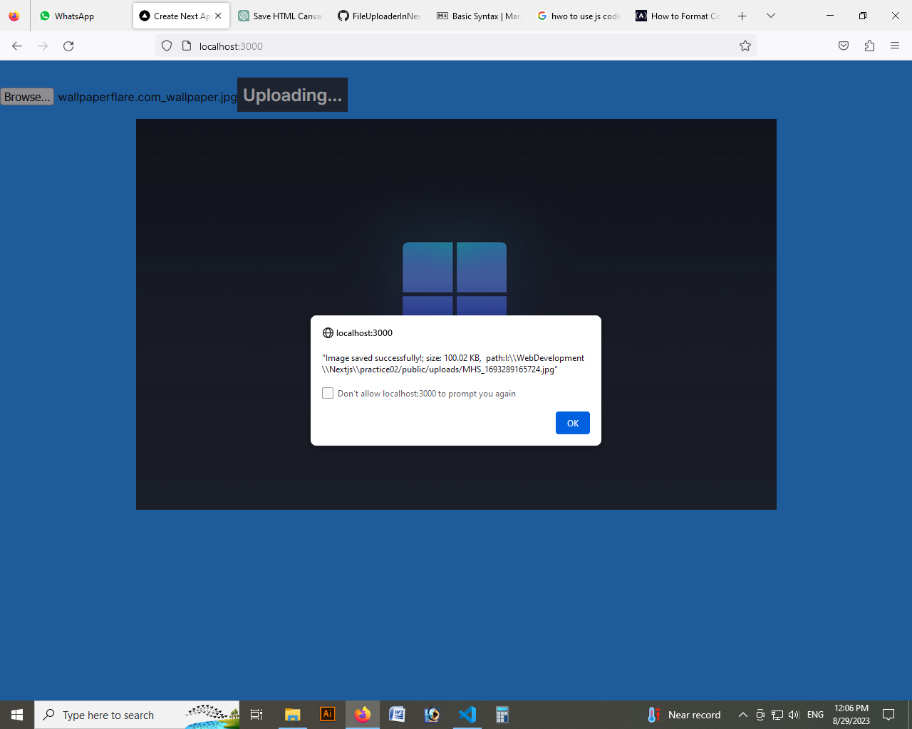

## Description
**This is a nextjs 13 file uploader project with auto image resizer**. 
I have not used any third party plugins like formidable, multer or sharp.
## Key fearutes
- Auto image resize during upload.
- You can upload any type of file.
- Image preview. When clicked upload button, If the file is an image, the resized image will be shown below the upload button.
  
- Uploaded file information from server.
  

- Image resize option is provided to set the quality of image resize. Its value is between 0-1. Default value is 0.6 which means resize the original image by 60%
```js
const resized = await imageResizer(SelectedImageFile, 0.6);
//Here original SelectedImageFile will be resized by 60%.
```
- This **imageResizer()** function returns original image information and resized image information.
     function")


This is a [Next.js](https://nextjs.org/) project bootstrapped with [`create-next-app`](https://github.com/vercel/next.js/tree/canary/packages/create-next-app).

## Getting Started

First, run the development server:

```bash
npm run dev
# or
yarn dev
# or
pnpm dev
```

Open [http://localhost:3000](http://localhost:3000) with your browser to see the result.


